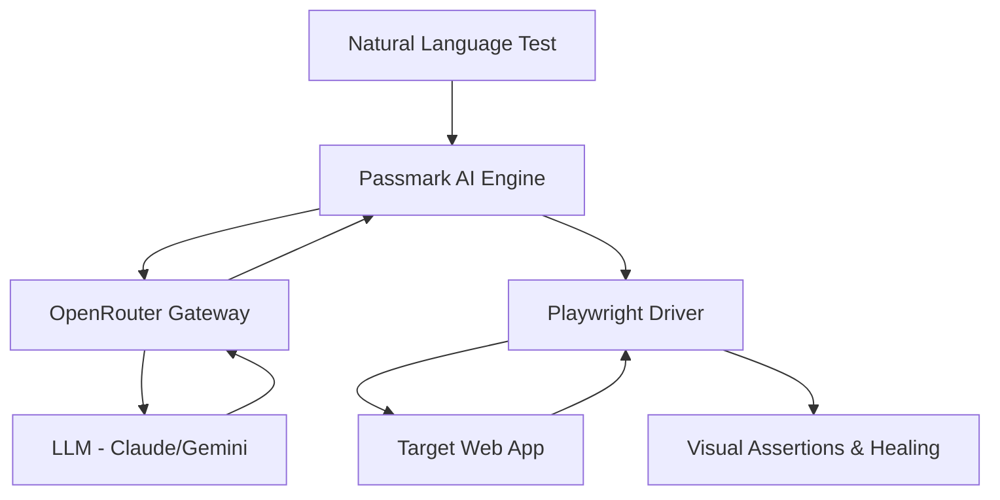

# 🤖 AI Autonomous SaaS Testing (Passmark + Playwright)

[](https://playwright.dev/)
[](https://github.com/passmark/passmark)
[](https://developer.mozilla.org/en-US/docs/Web/JavaScript)
[](https://github.com/features/actions)

> **The future of E2E testing is here.** Write tests in natural language, not selectors. Autonomous, self-healing, and production-ready.

---

## 🌟 Key Features

- **Natural Language Testing**: No more brittle CSS selectors or XPaths. Describe what you want to do in plain English.
- **Self-Healing AI**: Automatically detects UI changes, re-interprets failed steps, and retries with updated logic.
- **Multi-Browser Support**: Native support for Chromium, Firefox, and WebKit via Playwright.
- **Intelligent Assertions**: AI-driven validation of complex UI states like "Cart contains product" or "Dashboard loaded successfully".
- **Premium Reporting**: Generates beautiful Markdown reports with embedded failure screenshots and AI reasoning logs.
- **CI/CD Ready**: Pre-configured GitHub Actions workflow for automated testing on every push.

## 🏗️ Architecture

The framework leverages **Passmark** as the brain to translate natural language instructions into **Playwright** actions. **OpenRouter** provides access to state-of-the-art LLMs (like Claude 3.5 Sonnet) to power the autonomous flows.



## 🚀 Quick Start

### 1. Installation

```bash
git clone https://github.com/your-username/ai-autonomous-saas-testing-passmark.git
cd ai-autonomous-saas-testing-passmark
npm install
```

### 2. Configuration

Copy the environment template and add your OpenRouter API key:

```bash
cp .env.example .env
```

Edit `.env`:
```env
OPENROUTER_API_KEY=your_key_here
AI_MODEL=anthropic/claude-3-5-sonnet
```

### 3. Run Tests

```bash
# Run all tests
npm test

# Run tests in UI mode
npm run test:ui
```

## 📝 Example AI Flow

Tests are written using a declarative, step-based approach:

```javascript
test("User purchases a product", async ({ page }) => {
  await runSteps({
    page,
    userFlow: "E-commerce Purchase",
    steps: [
      { description: "Search for shoes" },
      { description: "Open first product" },
      { description: "Add product to cart" },
      { description: "Proceed to checkout" }
    ],
    assertions: [
      { assertion: "Cart contains the selected product" }
    ],
    test,
    expect
  });
});
```

## 🛠️ Reusable AI Helpers

We provide modular helpers in `utils/aiFlows.js` for common SaaS patterns:

- `loginFlow()`: Handles authentication with AI-driven form filling.
- `searchFlow()`: Performs semantic searches across any site.
- `runWithSelfHealing()`: Automatically retries failed interactions by analyzing the updated DOM.

## 📊 Reporting & Monitoring

After each run, a comprehensive Markdown report is generated in `reports/test-summary.md`. Failed tests automatically trigger:
1. **Timestamped Screenshots**: Captured and saved in `screenshots/`.
2. **AI Analysis**: Detailed reasoning for the failure and healing attempts.
3. **Artifact Upload**: Reports and images are preserved as GitHub Action artifacts.

## 🛣️ Roadmap

- [ ] Parallel execution optimization for 100+ AI flows.
- [ ] Visual regression testing integration.
- [ ] Support for voice-to-test (natural language via audio).
- [ ] Auto-generation of test cases from user behavior logs.

---

Built with ❤️ by the AI QA Community.
